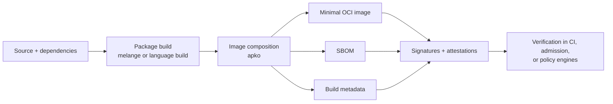

This section is for readers who understand programming but are still building
their mental model of secure container delivery.

The through-line is simple:

- reduce what ships
- make builds reproducible
- attach machine-verifiable metadata
- verify before promotion or runtime use

Those ideas show up repeatedly across the repositories in this workspace:

- `rookery` uses Chainguard-style `melange` + `apko` packaging for `cilock`
- `witness` and `go-witness` generate attestations that can carry provenance
- `sigstore` tools verify signatures and attestations
- `aflock` extends the same integrity story into AI-agent policy and runtime control

## The model at a glance

## Why this matters for SSCS

Attestations are only part of software supply chain security. If the shipped
artifact still contains an unnecessary shell, package manager, or stale OS
packages, you may have good provenance for a bad artifact.

Chainguard's ecosystem is useful because it ties three concerns together:

| Concern | Main question | Relevant tools |
| --- | --- | --- |
| Minimalism | What is actually inside the image? | distroless images, Wolfi |
| Reproducibility | Can we recreate the same artifact from the declared inputs? | `apko`, `melange` |
| Verifiability | Can another system confirm who built it and what metadata belongs to it? | SBOMs, attestations, Sigstore |

## Read this section in order

- [Supply chain security 101](./supply-chain-security-101/) introduces the
  beginner vocabulary.
- [Minimal container images](./minimal-container-images/) explains distroless
  design and the trade-offs it creates.
- [Wolfi and apko](./wolfi-and-apko/) shows how packages and images are
  composed.
- [Image hardening](./image-hardening/) turns those ideas into concrete
  engineering practices.
- [Vulnerability comparison](./vulnerability-comparison/) explains how to
  compare images without getting fooled by scanner output.
- [SBOMs and provenance](./sboms-and-provenance/) connects software inventory
  to attestations and verification.
- [AI bundle security](./ai-bundle-security/) applies the same thinking to
  model-adjacent artifacts, docs bundles, and agent runtimes.

## Job-ready checklist

You should be able to explain:

- why "distroless" is about attack-surface reduction, not magic immunity
- why `apko` is a composition tool and not a general-purpose Dockerfile
  replacement
- the difference between an SBOM, a signature, and an attestation
- why CVE counts need context such as scanner, freshness, exploitability, and
  package set
- how provenance, signatures, and runtime policy fit together for AI systems

## Related sections

- [Sigstore](/sigstore/)
- [witness](/witness/)
- [go-witness](/go-witness/)
- [aflock](/aflock/)
- [SPIFFE / SPIRE](/spiffe-spire/)

## Primary source anchors

- [Chainguard Containers overview](https://edu.chainguard.dev/chainguard/chainguard-images/overview/)
- [Wolfi overview](https://edu.chainguard.dev/open-source/wolfi/overview/)
- [apko getting started](https://edu.chainguard.dev/open-source/build-tools/apko/getting-started-with-apko/)
- [Strategies for minimizing CVE risk](https://edu.chainguard.dev/chainguard/chainguard-images/staying-secure/cve-risk/)
- [Vulnerability comparisons](https://edu.chainguard.dev/chainguard/chainguard-images/vuln-comparison/)
- [SBOMs and attestations](https://edu.chainguard.dev/open-source/sbom/sboms-and-attestations/)
- [What makes a good SBOM?](https://edu.chainguard.dev/open-source/sbom/what-makes-a-good-sbom/)
- [AI documentation security](https://edu.chainguard.dev/ai-docs-security/)

## Repository anchors

- `rookery/deploy/cilock/melange.yaml`
- `rookery/deploy/cilock/apko.yaml`
- `awesome-agent-runtime-security/README.md`
- `learning-aflock-witness-rookery/09-rookery-deep-dive-and-ecosystem.md`
