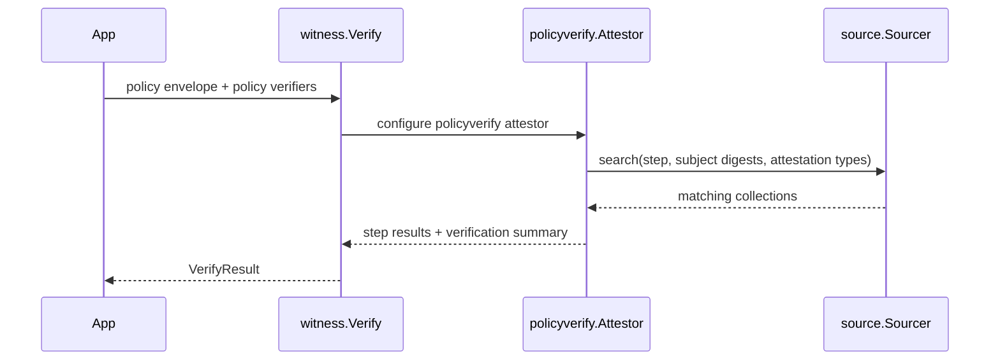

The root package gives you four entry points that matter most in application
code:

- `RunWithExports` for generating attestation collections and exported
  attestations
- `Sign` for signing arbitrary payloads as DSSE
- `VerifySignature` for envelope-level signature validation
- `Verify` for policy-based attestation verification

## Run and RunWithExports

`Run` is a thin compatibility wrapper around the internal `run()` helper and is
deprecated. New code should use `RunWithExports`.

`RunWithExports(stepName, opts...)` returns a slice of `RunResult` values:

- one result for the collection itself
- plus one result per attestor that implements `Exporter` or `MultiExporter`

```go
package main

import (
	"crypto"
	"crypto/rand"
	"crypto/rsa"
	"fmt"

	witness "github.com/in-toto/go-witness"
	"github.com/in-toto/go-witness/attestation"
	"github.com/in-toto/go-witness/attestation/commandrun"
	"github.com/in-toto/go-witness/attestation/material"
	"github.com/in-toto/go-witness/attestation/product"
	"github.com/in-toto/go-witness/cryptoutil"
)

func main() {
	privateKey, _ := rsa.GenerateKey(rand.Reader, 2048)
	signer := cryptoutil.NewRSASigner(privateKey, crypto.SHA256)

	results, err := witness.RunWithExports(
		"build",
		witness.RunWithSigners(signer),
		witness.RunWithAttestors([]attestation.Attestor{
			material.New(),
			commandrun.New(commandrun.WithCommand([]string{"sh", "-c", "echo ok > artifact.txt"})),
			product.New(),
		}),
	)
	if err != nil {
		panic(err)
	}

	fmt.Println("run results:", len(results))
}
```

### Important options

- `RunWithSigners(...)` attaches one or more `cryptoutil.Signer` values
- `RunWithAttestors(...)` sets the attestors to execute
- `RunWithAttestationOpts(...)` passes `attestation.AttestationContextOption`
  values such as `WithWorkingDir`
- `RunWithTimestampers(...)` timestamps each DSSE signature
- `RunWithInsecure(true)` skips signing and returns unsigned results
- `RunWithIgnoreErrors(true)` preserves partial results when some attestors fail

## Sign

`Sign(r io.Reader, dataType string, w io.Writer, opts ...dsse.SignOption)` is
the lowest-friction API when you already have a payload and only need a DSSE
envelope.

```go
package main

import (
	"bytes"
	"crypto"
	"crypto/rand"
	"crypto/rsa"
	"strings"

	witness "github.com/in-toto/go-witness"
	"github.com/in-toto/go-witness/cryptoutil"
	"github.com/in-toto/go-witness/dsse"
)

func main() {
	privateKey, _ := rsa.GenerateKey(rand.Reader, 2048)
	signer := cryptoutil.NewRSASigner(privateKey, crypto.SHA256)

	var out bytes.Buffer
	err := witness.Sign(
		strings.NewReader(`{"hello":"world"}`),
		"application/json",
		&out,
		dsse.SignWithSigners(signer),
	)
	if err != nil {
		panic(err)
	}
}
```

## VerifySignature

`VerifySignature` only checks DSSE signatures. It does not interpret Witness
policies or attestation collections.

Use it when you already know which verifiers should be trusted.

```go
envelope, err := witness.VerifySignature(bytes.NewReader(rawEnvelope), verifier)
if err != nil {
	panic(err)
}

fmt.Println(envelope.PayloadType)
```

## Verify

`Verify` is the policy-aware path:

1. verify the policy envelope signature
2. construct a `policyverify` attestor
3. search one or more collection sources
4. verify collection signatures
5. evaluate step requirements and Rego rules
6. return a `VerifyResult` with a `slsa.VerificationSummary`



The minimum useful options are:

- `VerifyWithCollectionSource(...)`
- `VerifyWithSubjectDigests(...)`

You can also attach signers with `VerifyWithSigners(...)` if you want the
verification summary itself signed; otherwise `Verify` falls back to
`RunWithInsecure(true)` for the summary envelope.

## Return types worth using

- `RunResult.Collection` is the structured collection object
- `RunResult.SignedEnvelope` is the DSSE envelope you can store or transport
- `VerifyResult.VerificationSummary` is the SLSA verification summary predicate
- `VerifyResult.StepResults` explains which policy steps passed or failed

## Related sections

- [Attestation framework](/go-witness/attestation-framework/)
- [Sources and policy verification](/go-witness/sources-and-policy/)
- [Witness verify](/witness/witness-verify/)
