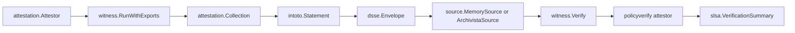

`go-witness` is the Go library underneath the Witness CLI. It gives you the
same core building blocks in-process: attestors, DSSE signing, in-toto
statements, policy verification, signer registries, and attestation sources.

This section is for Go developers building:

- CI/CD services that need to emit attestations without shelling out to `witness`
- controllers or operators that verify evidence inside Kubernetes
- custom attestors and signer providers for organization-specific metadata
- services that want to sign and verify in-toto statements directly

## What the library exposes

At the package root, `github.com/in-toto/go-witness` exports three top-level
flows:

- `Run` and `RunWithExports` to execute attestors and build attestation
  collections
- `Sign` to wrap arbitrary payloads in a DSSE envelope
- `Verify` and `VerifySignature` to validate DSSE signatures and evaluate
  Witness policies

Under that root package, the repo is organized into packages for the attestation
framework, cryptographic primitives, signer/provider registries, policy
evaluation, and attestation sources.



## Two import styles

The root `witness` package has side-effect imports in
`go-witness/imports.go` and `go-witness/imports_nonwindows.go`. Importing the
root package registers the built-in attestors plus the `file`, `fulcio`,
`spiffe`, and `vault` signer providers.

That is convenient when you want the default registry population:

```go
import witness "github.com/in-toto/go-witness"
```

When you want a smaller binary or explicit control, import only the packages you
need and instantiate their types directly:

```go
import (
  witness "github.com/in-toto/go-witness"
  "github.com/in-toto/go-witness/attestation/material"
  "github.com/in-toto/go-witness/attestation/product"
)
```

## Architecture notes from the repo

- `Run` is marked deprecated in `run.go`; prefer `RunWithExports` for new code.
- Attestors run by stage, and each stage executes concurrently inside
  `attestation.AttestationContext.RunAttestors`.
- Collection verification is implemented as another attestor:
  `attestation/policyverify`.
- Policies use the `policy` package plus `source.VerifiedSourcer` to search for
  signed collections that match expected steps and subjects.
- DSSE envelopes can contain raw verifier-based signatures or x509 chains plus
  RFC 3161 timestamps.

## Start here

- [Installation and module setup](/go-witness/installation/)
- [Core API: Run, Sign, Verify](/go-witness/core-api/)
- [Attestation framework](/go-witness/attestation-framework/)
- [Building custom attestors](/go-witness/custom-attestors/)
- [Cryptographic helpers](/go-witness/cryptoutil/)
- [DSSE and in-toto](/go-witness/dsse-and-intoto/)
- [Signer registry and custom signers](/go-witness/signers/)
- [Sources and policy verification](/go-witness/sources-and-policy/)
- [Using go-witness in Kubernetes](/go-witness/kubernetes/)

## Related sections

- [Witness CLI](/witness/) for the shell-oriented workflow built on this library
- [Rookery](/rookery/) for a plugin-packaged fork and distribution model
- [Sigstore](/sigstore/) for Fulcio and keyless signing context
- [SPIFFE / SPIRE](/spiffe-spire/) for workload identity-backed signing
