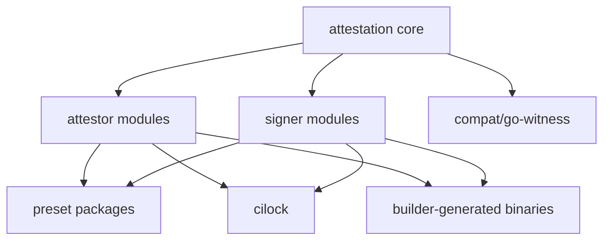

`rookery` is organized so the repo structure mirrors the runtime structure.
Core attestation logic lives in one module, plugins live in many modules, and
top-level binaries decide which plugins to import.

## Layered layout



The source tree follows that model closely:

- `attestation/` contains interfaces, workflow orchestration, DSSE support,
  policy evaluation, source backends, and crypto helpers
- `plugins/attestors/` contains one Go module per attestor
- `plugins/signers/` contains one Go module per signer, plus KMS provider
  modules under `plugins/signers/kms/`
- `presets/` contains blank-import packages that register curated plugin sets
- `cilock/` is the full CLI that imports every plugin listed in
  `cilock/cmd/cilock/main.go`
- `builder/` generates a separate binary that blank-imports only selected
  plugins
- `compat/go-witness/` re-exports rookery types under the upstream
  `github.com/in-toto/go-witness` module path

## Attestor lifecycle

Every attestor registers a `RunType`. The core library uses those stages to
decide when a predicate should execute.

| Run type | Meaning | Examples |
| --- | --- | --- |
| `PreMaterialRunType` | Capture environment or identity before filesystem snapshot | `environment`, `git`, `github`, `aws-codebuild` |
| `MaterialRunType` | Record input files before execution | `material` |
| `ExecuteRunType` | Capture command or action execution itself | `command-run`, `github-action` |
| `ProductRunType` | Record output files after execution | `product` |
| `PostProductRunType` | Derive higher-level predicates from produced artifacts | `slsa`, `sbom`, `sarif`, `oci`, `link` |
| `VerifyRunType` | Summarize policy verification | `policyverify` |

The default `cilock run` path is therefore:

```text
pre-material attestors
        ->
material snapshot
        ->
command execution
        ->
product snapshot
        ->
post-product derivations
```

Two attestors are always injected by `cilock run`:

- `material`
- `product`

Two more are the defaults when you do not override `--attestations`:

- `environment`
- `git`

## Registration and dynamic flags

The attestation core exposes a registry so each plugin can register:

- its name
- predicate type URI
- run stage
- a factory function
- optional configuration fields

`cilock` uses that registry to generate CLI flags dynamically. The naming
pattern comes from `cilock/internal/options/options.go`:

- attestor flags look like `--attestor-<name>-<option>`
- signer flags look like `--signer-<name>-<option>`
- verifier flags look like `--verifier-<name>-<option>`

Examples that exist in the current repo:

```bash
./bin/cilock attestors schema k8smanifest
./bin/cilock run --step build --outfile build.json \
  --signer-debug-enabled \
  -a slsa \
  --attestor-slsa-export \
  -- go build ./...
./bin/cilock run --step deploy --outfile deploy.json \
  --signer-debug-enabled \
  -a k8smanifest \
  --attestor-k8smanifest-kubeconfig ~/.kube/config \
  --attestor-k8smanifest-server-side-dry-run \
  -- kubectl apply -f k8s/
```

## `cilock` versus presets versus builder

The repo has three different ways to talk about "included plugins":

1. `cilock/cmd/cilock/main.go` imports the full set used by the CLI.
2. `presets/*/imports.go` exposes Go packages you can blank-import from your
   own program.
3. `builder/cmd/builder/main.go` keeps its own preset map for generated
   binaries.

That design is useful, but it means counts can differ:

- `cilock` imports `29` attestors and `9` signers
- `presets/all` imports `27` attestors and `9` signers
- builder preset `all` also imports `27` attestors and `9` signers, but not the
  same `27`

The preset page lists the exact differences.

## Compatibility surfaces

Rookery has two separate compatibility mechanisms.

### Legacy predicate aliases

`attestation/legacy.go` maps older `witness.dev` and
`witness.testifysec.com` predicate URIs to the current `aflock.ai`
equivalents. `cilock` calls `attestation.RegisterLegacyAliases()` at startup,
so envelopes produced by older Witness tooling can still deserialize.

### `go-witness` import shim

`compat/go-witness/go.mod` declares the upstream module path:

```go
module github.com/in-toto/go-witness
```

Inside that module, exported types and functions are mostly aliases back to
rookery. That means an upstream plugin can often compile unchanged if your
build adds a `replace` directive pointing at `compat/go-witness/`.

## Dark corners worth knowing

- `cilock` is compiled with `//go:debug fips140=on`.
- The builder can optionally emit `//go:debug fips140=<mode>` in its generated
  main file.
- The compatibility shim is broad, but it is still a shim. Source-backed
  testing in `compat_*_test.go` is the real confidence signal.
- Builder presets and preset packages are close, not identical. Do not assume a
  preset name means the same thing in all three surfaces.

## Repository anchors

- `rookery/attestation/`
- `rookery/cilock/cmd/cilock/main.go`
- `rookery/cilock/internal/options/options.go`
- `rookery/presets/minimal/imports.go`
- `rookery/presets/cicd/imports.go`
- `rookery/presets/all/imports.go`
- `rookery/compat/go-witness/witness.go`
- `rookery/attestation/legacy.go`
